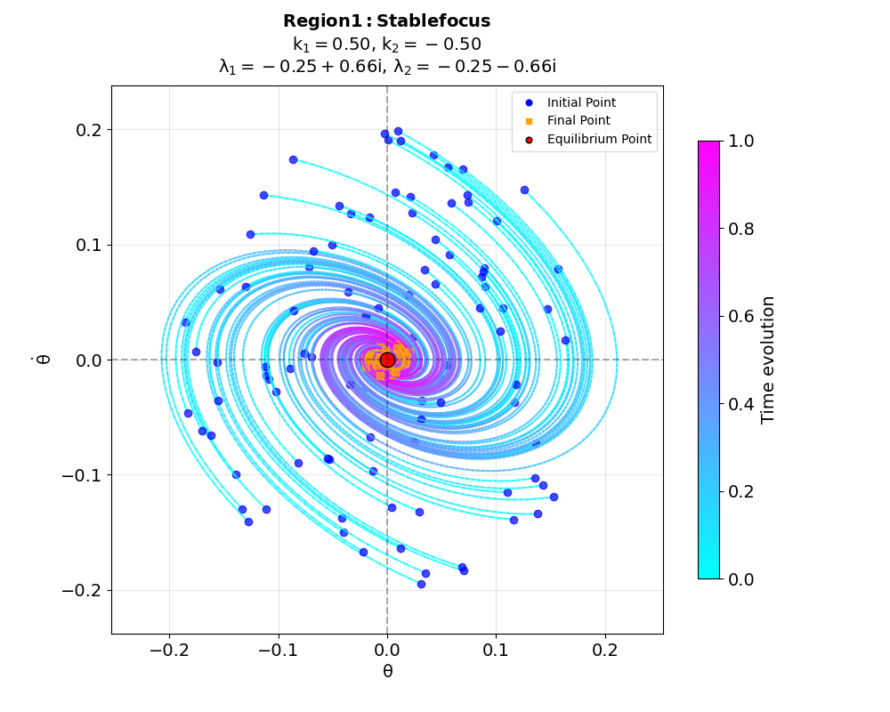

# Advanced Control Methods Seminars 2025

This repository contains materials for the Advanced Control Methods course seminars. The course explores various control theory concepts through practical implementations and simulations.



> Throughout this course, your focus should be stable - just like Region 1 above!

## Repository Structure

The repository is organized into three seminar folders, each focusing on different aspects of control theory:

```
Advanced-Control-Methods-seminars-2025/
├── seminar_1_bang_bang_control/  - Bang-Bang Control
├── seminar_2_motion_simulation/  - Point Motion Simulation and Linear Transformations
├── seminar_3_stability_analysis/ - System Stability Analysis
├── utils/                       - Common utilities and base classes
└── .gitattributes
```

> **Note:** If you see additional folders named "seminar 2" and "seminar 3" in the repository, they are legacy folders that should be deleted manually.

## Seminar 1: Bang-Bang Control

This seminar focuses on time-optimal control systems using bang-bang control, where the control input switches between extreme values.

### Key Files:
- `plot_generator.py`: Python script for generating phase portraits of bang-bang control trajectories
- `sem_1_ans.md`: Solutions to various bang-bang control problems with links to interactive Desmos calculators
- `images/phase_portrait.png`: Visualization of multiple bang-bang control trajectories in phase space
- `images/full_solution.gif`: Animated visualization of bang-bang control behavior

### Implementation Details:
The code implements:
- Bang-bang control parameter calculation based on initial conditions
- Control function implementation for time-optimal trajectories
- Simulation and visualization of the system dynamics
- Phase portrait generation with various initial conditions

## Seminar 2: Point Motion Simulation and Linear Transformations

This seminar explores point motion dynamics and linear system transformations.

### Key Files:
- `sem_2_ans.ipynb`: Jupyter notebook containing interactive simulations and explanations
- `sem_2_ans.md`: Markdown document with theory and problem descriptions

### Key Topics:
- Circular Motion of a Point: Simulation of point trajectories with orthogonal velocity vectors
- Linear Transformations: Implementation of rotations, scaling, and translations
- System Stability Analysis: Evaluation of motion stability under different conditions

## Seminar 3: System Stability Analysis

This seminar focuses on analyzing equilibrium types and stability regions in dynamic systems.

### Key Files:
- `sem_3_ans.ipynb`: Main notebook with comprehensive stability analysis
- `sem_3_ans.md`: Markdown document with theory explanations
- `phase.py`: Core module implementing system dynamics and stability visualization
- `analyze.py`: Script for analyzing different equilibrium regions
- `check_k.py`: Script for parameter validation
- `plot_stability_regions.py`: Visualization tool for stability regions
- `region_*_simulation.png`: Visualizations of different stability regions
- `equilibrium_types_collage.png`: Composite image showing all equilibrium types

### Equilibrium Types:
The code analyzes 8 different equilibrium types:
1. Stable focus (damped oscillations)
2. Stable node (aperiodic damping)
3. Critical damping
4. Neutral stability (center)
5. Unstable focus
6. Saddle point
7. Saddle-node boundary
8. Degenerate case (one eigenvalue zero)

## Utils Directory

The `utils` directory contains common utility functions and base classes:

- `simulation_utils.py`: Common functions for numerical integration, visualization, and stability analysis
- `control_system.py`: Base classes for control systems, including a generic ControlSystem class and a BangBangControlSystem class

## Usage

Each seminar folder contains standalone code that can be run independently. Jupyter notebooks can be opened and executed in any Jupyter environment, while Python scripts can be run from a terminal.

### Prerequisites
- Python 3.x
- NumPy
- Matplotlib
- Seaborn (for some visualizations)
- Jupyter (for notebook files)

## Additional Resources

Each seminar includes references to supplementary materials:
- Interactive Desmos calculators for bang-bang control
- Google Colab notebooks for additional exploration
- Visualizations of system behavior under different conditions 