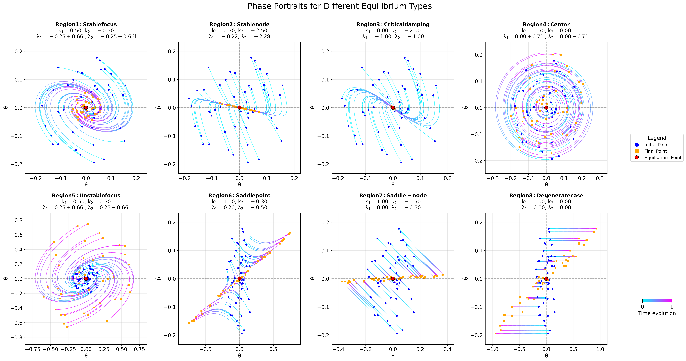

# Seminar 3: System Stability Analysis

This seminar focuses on analyzing the equilibrium types and stability regions in dynamic systems. We explore different types of equilibrium points, their characteristics, and how to classify them based on eigenvalue analysis.

## Overview

Stability analysis is a fundamental concept in control theory that helps understand how systems behave around equilibrium points. This seminar provides both theoretical background and practical implementation for analyzing stability in linear systems.

## Contents

- `phase.py`: Core module for system dynamics and stability visualization
- `analyze.py`: Script for analyzing different equilibrium regions
- `check_k.py`: Script for parameter validation
- `plot_stability_regions.py`: Visualization tool for stability regions
- `examples/`: Directory containing example problems and solutions
- `images/`: Directory containing generated images and stability region visualizations

## Key Concepts

- **Equilibrium Points**: Points where the system dynamics are zero
- **Eigenvalue Analysis**: Using eigenvalues to determine stability properties
- **Phase Portraits**: Visualization of system trajectories in state space
- **Stability Regions**: Parameter spaces where the system exhibits different stability behaviors

## Equilibrium Types Visualization

The following image shows all eight equilibrium types analyzed in this seminar:

This collage demonstrates the different trajectory patterns that emerge around equilibrium points, depending on the system parameters and resulting eigenvalues.

## Equilibrium Types

The code analyzes 8 different equilibrium types:

1. **Stable Focus (Region 1)**
   - Damped oscillations
   - Eigenvalues: Complex with negative real part
   - Condition: k1 < 1, k2 < 0, k2² < 4(1-k1)

2. **Stable Node (Region 2)**
   - Aperiodic damping
   - Eigenvalues: Real and negative
   - Condition: k1 < 1, k2 < 0, k2² > 4(1-k1)

3. **Critical Damping (Region 3)**
   - Boundary between stable focus and stable node
   - Eigenvalues: Repeated real negative values
   - Condition: k1 < 1, k2 < 0, k2² = 4(1-k1)

4. **Neutral Stability/Center (Region 4)**
   - Undamped oscillations
   - Eigenvalues: Pure imaginary (no real part)
   - Condition: k1 < 1, k2 = 0

5. **Unstable Focus (Region 5)**
   - Growing oscillations
   - Eigenvalues: Complex with positive real part
   - Condition: k1 < 1, k2 > 0

6. **Saddle Point (Region 6)**
   - Unstable equilibrium with stable and unstable manifolds
   - Eigenvalues: Real with opposite signs
   - Condition: k1 > 1

7. **Saddle-Node (Region 7)**
   - Special boundary case
   - Eigenvalues: One zero, one negative
   - Condition: k1 = 1, k2 < 0

8. **Degenerate Case (Region 8)**
   - One eigenvalue is zero
   - Eigenvalues: One zero, one non-negative
   - Condition: k1 = 1, k2 ≥ 0

## System Dynamics

The system is represented in matrix form as:

$$\dot{\mathbf{x}} = A\mathbf{x}$$

where A is the system matrix:

$$A = \begin{pmatrix} 0 & 1 \\ -1 + k_1 & k_2 \end{pmatrix}$$

Parameters k₁ and k₂ determine the system's behavior and stability properties.

## Usage

The scripts in this directory can be used to:

1. Analyze stability regions for different parameter values
2. Generate phase portraits for each equilibrium type
3. Visualize the boundaries between different stability regions
4. Classify equilibrium points based on eigenvalue analysis

## Examples

See the `examples/` directory for various parameter combinations and their resulting stability properties. The region simulations demonstrate typical trajectories for each type of equilibrium point.

## References

- Strogatz, S. H. (2018). Nonlinear Dynamics and Chaos: With Applications to Physics, Biology, Chemistry, and Engineering. CRC Press.
- Khalil, H. K. (2002). Nonlinear Systems (3rd ed.). Prentice Hall. 